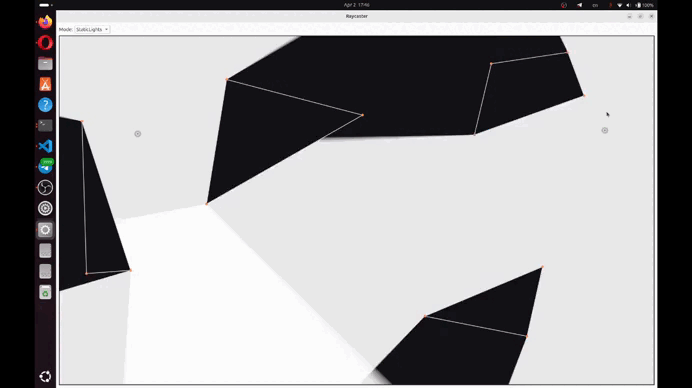

# Raycaster

Raycaster is an interactive 2D lighting visualizer built with Qt and Bazel.  
It allows the user to place polygonal obstacles, move light sources around the scene, and observe how visibility, shadows, and soft shadow effects are formed in real time.

The project is based on 2D raycasting: rays are cast from light sources toward obstacle vertices, intersected with scene geometry, and then used to reconstruct the visible illuminated area.

## Demo



## Features

- Interactive 2D raycasting-based lighting
- Polygon drawing mode for creating obstacles
- Dynamic light source controlled by the user
- Soft shadows via multiple nearby light samples
- Static light mode for placing permanent additional lights
- Collision handling:
  - a light source cannot be placed inside an obstacle
  - intersecting polygons are rejected
  - self-intersecting polygons are rejected

## Interaction Modes

The application supports three working modes.

### 1. Light

This mode is used to control the current active light source.

Controls:
- Move the mouse to move the active light source
- Right mouse button:
  - if the source is following the cursor, it becomes fixed in place
  - if the source is fixed, it starts following the cursor again
- Left mouse button:
  - places the active light source at the clicked position

### 2. Polygons

This mode is used to create polygonal obstacles.

Controls:
- Left mouse button:
  - first click starts a new polygon
  - each next click adds a new vertex
- Move the mouse to preview the next edge
- Right mouse button:
  - finishes the current polygon

Invalid polygons are automatically rejected:
- self-intersecting polygons
- polygons intersecting existing obstacles

### 3. Static Lights

This mode is used to place permanent additional light sources.

Controls:
- Right mouse button:
  - toggles whether the current active light follows the cursor
- Left mouse button:
  - converts the current active light into a permanent static light
  - creates a new active light that remains under user control

Static lights illuminate the scene exactly like the dynamic one.


## How It Works

For each light sample:
1. Rays are cast toward all obstacle vertices
2. Two additional rays with a very small angular offset are generated for each vertex
3. All rays are intersected with scene geometry
4. The nearest intersections are selected
5. Ray endpoints are sorted by angle
6. A visibility polygon is reconstructed from the sorted endpoints

To create soft shadows, a single light source is represented as a compact cluster of nearby light samples.  
Each sample contributes a semi-transparent illuminated region.  
When these regions overlap, penumbra-like soft shadow effects appear.

## Project Structure

```text
labs/basics/Homework2/
├── BUILD
└── src
    ├── app
    │   ├── DrawWidget.cpp
    │   ├── DrawWidget.h
    │   ├── MainWindow.cpp
    │   └── MainWindow.h
    ├── core
    │   ├── Controller.cpp
    │   ├── Controller.h
    │   ├── Polygon.cpp
    │   ├── Polygon.h
    │   ├── Ray.cpp
    │   └── Ray.h
    ├── geometry
    │   ├── GeometryUtils.cpp
    │   └── GeometryUtils.h
    ├── ui
    │   ├── Modes.h
    │   └── RenderConfig.h
    └── main.cpp
```
## Requirements

- Linux
- Bazel
- Qt6
- Modern C++ compiler

The project uses `rules_qt` for Qt integration with Bazel.

## Build

From the repository root, run:

```bash
bazel build //labs/basics/Homework2:basics
```

## Run

```bash
bazel run //labs/basics/Homework2:basics
```

## Notes

- Core geometry is implemented manually
- Qt is used only for GUI and rendering
- Qt geometry helpers such as `QPolygon` and `QLineF` are not used in the core geometric logic

## Possible Improvements

- bounded-radius lights
- colored light sources
- scene save/load support
- obstacle editing after creation
- performance improvements for larger scenes
- more advanced rendering and visual effects
